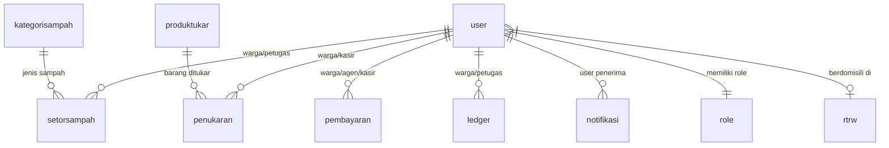

# 📘 DOKUMEN KONTEKS APLIKASI: GO SARI LESTARI
> **Catatan untuk LLM / AI Prompt:**  
> Dokumen ini adalah *Single Source of Truth* arsitektur teknis dan aturan bisnis aplikasi **GO SARI Lestari**. Gunakan konteks ini untuk menjawab semua pertanyaan teknis, pencarian file, alur transaksi, maupun logika bisnis tanpa perlu membaca ulang seluruh codebase.

---

## 1. Ringkasan Eksekutif & Konsep Bisnis

* **Nama Aplikasi**: **GO SARI Lestari**
* **Kategori**: Bank Sampah & Manajemen Iuran Berbasis *Progressive Web App* (PWA).
* **Tujuan Utama**: 
  1. Mengelola setoran sampah warga yang dipilah berdasarkan kategori.
  2. Mengonversi hasil setoran sampah menjadi saldo kas warga (rupiah).
  3. Mengakomodasi pemotongan iuran sampah bulanan otomatis dari saldo warga.
  4. Menyediakan penukaran saldo warga dengan produk/kebutuhan rumah tangga (misal: Gas LPG 3kg, Bright Gas, dll.).
  5. Memfasilitasi pembayaran iuran manual/transfer melalui Agen atau Kasir jika saldo tidak mencukupi.

---

## 2. Tech Stack & Arsitektur Teknis

* **Backend Framework**: PHP 7.x / 8.x dengan **CodeIgniter 3** (pola HMVC modular, `MY_Controller` & `MY_Model` custom).
* **Database**: MySQL / MariaDB (Database default: `gosarilestaridb`).
* **Frontend & UI**: Tailwind CSS (utility classes), AdminLTE icon/fa-kit, jQuery DataTables, Select2, Leaflet.js (Peta RT/RW), Chart.js (Grafik volume sampah).
* **PWA**: Didukung `manifest.json`, icon multi-ukuran, dan service worker untuk pengalaman aplikasi mobile.
* **Libraries Utama**:
  * `Dompdf / pdf.php`: Generator laporan PDF (laporan warga & petugas).
  * `Datatables.php`: Server-side processing untuk tabel data.
* **Konvensi Database & Kode**:
  * **Primary Key**: Semua tabel utama menggunakan `uuid` (`varchar(36)`), dihasilkan otomatis dengan `UUID()` MySQL.
  * **Audit Trail**: Kolom `createdAt`, `updatedAt`, `deletedAt` (Soft Deletes aktif di semua model via `MY_Model`).
  * **Kode Transaksi/Warga**: Kolom `kode` 6 digit alfanumerik acak (`strtoupper(base_convert(time() + rand(), 10, 36))`).
  * **Password Hashing**: Menggunakan `md5($password)`.

---

## 3. Matriks Hak Akses & Peran Pengguna (5 Roles)

Tabel `user` menyimpan seluruh akun pengguna dengan pembeda pada foreign key `role`:

| Peran (Role) | Definisi & Tugas Utama | Menu yang Dapat Diakses | Akses Transaksi Utama |
| :--- | :--- | :--- | :--- |
| **Admin** | Pengelola sistem utama, kelola master data, aktivasi warga baru, konfigurasi sistem. | Dashboard, Warga, RT/RW, Kategori Sampah, Produk Tukar, Setor Sampah, Pembayaran, Penukaran, Ledger, Kasir, Agen, Petugas, Informasi, Konfigurasi, Notifikasi, Profile. | CRUD penuh seluruh entitas & konfigurasi. |
| **Kasir** | Petugas loket/kantor. Melayani approval penukaran barang, approval pembayaran transfer/setoran tunai dari warga & agen. | Dashboard, Warga, Produk Tukar, Pembayaran, Penukaran, Ledger, Informasi, Notifikasi, Profile. | Approve pembayaran, Approve penukaran barang, kelola stok produk. |
| **Agen** | Koordinator lingkungan/wilayah (RT). Menampung pembayaran tunai/transfer warga di lingkungannya sebelum disetor ke Kasir. | Dashboard, Warga, Pembayaran, Ledger, Informasi, Notifikasi, Profile. | Input & update pembayaran warga bawahannya, cek warga saldo minus. |
| **Petugas** | Petugas penimbang sampah di lapangan. Mencatat setoran sampah warga. | Dashboard, Warga, Setor Sampah, Ledger, Informasi, Notifikasi, Profile. | Input penimbangan sampah warga (Kategori pemilahan, jenis, berat). |
| **Warga** | Nasabah / pengguna layanan. Memantau saldo, ajukan pembayaran iuran transfer, ajukan penukaran gas/produk. | Dashboard, Pembayaran, Penukaran Produk, Riwayat Transaksi (Ledger), Informasi, Notifikasi, Profile. | Request penukaran, upload bukti transfer pembayaran, lihat mutasi saldo. |

---

## 4. Mekanisme Keuangan & Sistem Ledger (Single Source of Truth)

> ⚠️ **Prinsip Utama Saldo**: Kolom `user.saldo` **TIDAK PERNAH** dimanipulasi secara langsung. Nilai `saldo` selalu merupakan hasil penjumlahan agregat seluruh transaksi di tabel `ledger` yang berstatus aktif (`status = 1 AND deletedAt IS NULL`).

### Tipe Transaksi di Tabel `ledger`:
1. **`SETOR_SAMPAH` (+ Bertambah)**: Dihasilkan ketika Petugas mencatat setoran sampah warga yang bernilai ekonomis (`pendapatan = berat * harga_kategori`).
2. **`SETOR_TUNAI` (+ Bertambah)**: Dihasilkan saat pembayaran iuran (tunai/transfer) berhasil disetujui/di-approve oleh **Kasir** (status `KASIR`).
3. **`TUKAR_PRODUK` (- Berkurang)**: Dihasilkan saat permohonan penukaran barang (misal: Gas LPG) disetujui oleh **Kasir** (`APPROVED`).
4. **`POTONG_IURAN` (- Berkurang)**: Dihasilkan setiap awal bulan oleh Cron Job CLI sistem sebagai penarikan iuran wajib bulanan warga (`SETORAN_BULANAN`).

Setiap penambahan atau penghapusan baris pada `ledger` otomatis memicu:
* `Wargas->updateSaldo($wargaUuid, $saldo)`: Menghitung ulang total saldo warga.
* `Notifikasis->perubahanSaldo($ledger)`: Mengirim notifikasi in-app ke warga ("Saldo bertambah/berkurang Rp X").

---

## 5. Alur Bisnis Transaksional Kunci

### A. Alur Setor Sampah (Input Petugas)
1. Petugas menimbang sampah warga melalui menu `SetorSampah/Create`.
2. Input yang dimasukkan:
   * **Warga**: Dipilih dari autocomplete warga aktif.
   * **Kategori Pemilahan**: 
     * `merah` (Tidak terpilah sama sekali) -> Harga = Rp 0.
     * `kuning` (Terpilah sebagian).
     * `hijau` (Terpilah dengan sangat baik).
   * **Kategori Sampah**: Jenis material (`kategorisampah`: Plastik, Kertas, Logam, Kaca, Minyak Jelantah, dll).
   * **Berat**: Dalam kilogram (Kg).
3. **Kalkulasi**: `pendapatan = berat * harga_kategori`.
4. Jika `pendapatan > 0`:
   * Otomatis membuat entri `ledger` tipe `SETOR_SAMPAH`.
   * Saldo warga langsung bertambah.
   * Total sampah terkumpul bulan ini di tabel `konfigurasi` di-update.

### B. Alur Pembayaran Iuran Warga (Multi-Stage Approval)
Tabel `pembayaran` memiliki 3 tingkatan status: `WARGA` ➔ `AGEN` ➔ `KASIR`.

* **Skenario 1: Warga bayar tunai langsung ke Kasir**
  * Kasir membuat pembayaran baru langsung dengan status `KASIR`.
  * Kasir approve: Saldo warga otomatis bertambah di `ledger` (`SETOR_TUNAI`).
* **Skenario 2: Warga bayar transfer ke rekening Kasir**
  * Warga input pembayaran status `WARGA` + upload `buktitransfer`.
  * Sistem kirim notifikasi ke semua Kasir.
  * Kasir cek mutasi bank; jika valid, Kasir ubah status ke `KASIR` (Approve).
* **Skenario 3: Warga bayar tunai ke Agen RT**
  * Agen input pembayaran status `AGEN`.
  * Warga melihat di mutasinya. Agen membawa fisik uang tunai ke Kasir bank sampah.
  * Kasir menghitung uang fisik; jika cocok, Kasir ubah status ke `KASIR` (Approve).
* **Skenario 4: Warga transfer ke rekening Agen RT**
  * Warga input pembayaran status `WARGA` ditujukan ke Agen + upload bukti transfer.
  * Agen cek mutasi bank agen; jika sesuai, Agen ubah status ke `AGEN`.
  * Agen menyetorkan uang ke Kasir, Kasir validasi dan ubah status ke `KASIR` (Approve).

### C. Alur Penukaran Produk / Gas LPG
1. Warga mengajukan penukaran produk via menu `Penukaran/Create` (Status awal: `PENDING`).
2. Kasir membuka detail penukaran dan melakukan validasi (`validateApproval`):
   * Apakah stok barang masih mencukupi? (`stok >= qty`).
   * Apakah saldo warga mencukupi? (`saldo >= total_harga`).
3. Jika valid, Kasir klik Approve (Status menjadi `APPROVED`):
   * Stok produk berkurang (`ProdukTukars->sold()`).
   * Ledger mencatat pengeluaran tipe `TUKAR_PRODUK` bernilai negatif.
   * Saldo warga berkurang otomatis.
4. **Mekanisme Rollback (Batal/Hapus Penukaran)**:
   * Jika record penukaran yang sudah `APPROVED` dihapus oleh Kasir/Admin, sistem otomatis membatalkan penjualan (`ProdukTukars->unsold()`) dan menghapus entri ledger terkait sehingga saldo warga kembali utuh.

---

## 6. Kamus Data & Skema Database

### 1. `user` (Tabel Pengguna: Admin, Kasir, Agen, Petugas, Warga)
* `uuid` (VARCHAR 36, PK)
* `orders` (INT Auto Increment)
* `username`, `password` (MD5)
* `role` (VARCHAR 36, FK ke `role.uuid`)
* `kode` (VARCHAR 6, kode unik)
* `nama`, `kontak` (No. HP/WA), `alamat`
* `rtrw` (VARCHAR 36, FK ke `rtrw.uuid`)
* `agen` (VARCHAR 36, FK ke `user.uuid` peran Agen yang menaungi)
* `saldo` (FLOAT, cache saldo agregat ledger)
* `status` (TINYINT: 1=Aktif, 0=Nonaktif)
* `activatedAt` (DATETIME, NULL jika pendaftar baru belum disetujui Admin)
* `createdAt`, `updatedAt`, `deletedAt`

### 2. `kategorisampah` (Master Sampah & Harga)
* `uuid`, `orders`, `kode`
* `nama` (VARCHAR: Plastik, Kertas, Logam, Kaca, Minyak Jelantah, Sampah Tidak Terpilah)
* `contoh` (VARCHAR: contoh barang seperti botol PET, kardus)
* `harga` (FLOAT: harga per kilogram, misal 3500)
* `status`, `createdAt`, `updatedAt`, `deletedAt`

### 3. `produktukar` (Master Barang Tukar Poin/Saldo)
* `uuid`, `orders`, `kode`
* `nama` (VARCHAR: Gas LPG 3KG, Gas Bright 5.5KG, dll.)
* `kategori` (VARCHAR: Gas Subsidi, Gas Non Subsidi, Sembako)
* `harga` (FLOAT: harga tukar rupiah)
* `stok` (INT: sisa stok fisik)
* `terjual` (INT: jumlah yang sudah ditukarkan)
* `status`, `createdAt`, `updatedAt`, `deletedAt`

### 4. `ledger` (Buku Kas & Riwayat Mutasi Warga)
* `uuid`, `orders`, `kode`
* `transaksi` (VARCHAR 36: UUID record asal dari setorsampah/pembayaran/penukaran)
* `warga` (VARCHAR 36, FK ke `user.uuid`)
* `petugas` (VARCHAR 36: UUID Kasir/Petugas, atau string 'SYSTEM' untuk cron)
* `tipe` (ENUM: `'SETOR_SAMPAH'`, `'TUKAR_PRODUK'`, `'SETOR_TUNAI'`, `'POTONG_IURAN'`)
* `keterangan` (VARCHAR: deskripsi mutasi)
* `nilai` (BIGINT: nominal mutasi; positif menambah saldo, negatif mengurangi saldo)
* `status`, `createdAt`, `updatedAt`, `deletedAt`

### 5. `setorsampah` (Transaksi Setoran Sampah)
* `uuid`, `orders`, `kode`
* `warga` (FK ke `user.uuid`)
* `petugas` (FK ke `user.uuid` Petugas penimbang)
* `kategori` (VARCHAR: `'merah'`, `'kuning'`, `'hijau'`)
* `kategorisampah` (FK ke `kategorisampah.uuid`)
* `berat` (FLOAT: bobot timbangan kg)
* `pendapatan` (FLOAT: `berat * harga`)
* `status`, `createdAt`, `updatedAt`, `deletedAt`

### 6. `pembayaran` (Transaksi Pembayaran Iuran)
* `uuid`, `orders`, `kode`
* `warga`, `agen`, `kasir` (FK ke `user.uuid`)
* `nominal` (FLOAT)
* `catatan` (VARCHAR)
* `buktitransfer` (VARCHAR: path file upload bukti transfer)
* `status` (ENUM: `'WARGA'`, `'AGEN'`, `'KASIR'`)
* `approvedAt` (DATETIME)
* `createdAt`, `updatedAt`, `deletedAt`

### 7. `penukaran` (Transaksi Penukaran Saldo ke Barang)
* `uuid`, `orders`, `kode`
* `warga`, `kasir` (FK ke `user.uuid`)
* `produktukar` (FK ke `produktukar.uuid`)
* `harga` (FLOAT), `qty` (INT), `total` (FLOAT: `harga * qty`)
* `status` (ENUM: `'PENDING'`, `'APPROVED'`)
* `approvedAt` (DATETIME)
* `createdAt`, `updatedAt`, `deletedAt`

### 8. `rtrw` (Data Wilayah & Titik Koordinat Peta)
* `uuid`, `orders`, `kode`
* `nama` (VARCHAR: misal 'Kembangputihan RT 001', 'Kentolan Lor RT 001')
* `latitude`, `longitude` (VARCHAR: titik koordinat GPS untuk peta sebaran Leaflet)
* `status`, `createdAt`, `updatedAt`, `deletedAt`

### 9. `konfigurasi` (Parameter Global Sistem)
* `SETORAN_BULANAN`: Besaran iuran sampah bulanan per KK/warga (default: Rp 40.000).
* `TARGET_SAMPAH_BULAN_INI`: Target kumulatif berat sampah bulanan dalam Kg (default: 2000 Kg).
* `BATAS_MINIMUM_STOK_RENDAH`: Batas stok produk tukar untuk trigger indikator restock (default: 10).
* `SAMPAH_TERKUMPUL`: Total akumulasi berat sampah masuk bulan berjalan.

### 10. `notifikasi` (Pemberitahuan In-App)
* `user` (FK ke `user.uuid`), `judul`, `informasi` (TEXT/HTML), `isRead` (0=Belum, 1=Sudah).

### 11. `informasi` (Papan Pengumuman / Berita)
* `title`, `content` (TEXT).

---

## 7. Otomasi & Cron Jobs (CLI Controller)

Dieksekusi terjadwal di server melalui CLI CodeIgniter (`php index.php Cli <Metode>`):

1. **Tagihan Iuran Bulanan Warga**  
   * **Perintah**: `php index.php Cli KirimTagihanBulananWarga`
   * **Jadwal**: Setiap tanggal 1 pukul 00:00 UTC (`0 0 1 * *`).
   * **Cara Kerja**: Mencari seluruh warga aktif yang belum ditagih di bulan berjalan, lalu memotong saldo senilai `SETORAN_BULANAN` (Ledger: `POTONG_IURAN`).
2. **Reminder Bulanan Agen**  
   * **Perintah**: `php index.php Cli KirimNotifikasiBulananAgen`
   * **Jadwal**: Setiap tanggal 10 pukul 00:00 UTC (`0 0 10 * *`).
   * **Cara Kerja**: Mendata warga yang saldonya masih minus (menunggak tagihan) dan warga yang bulan lalu menyetor sampah tidak terpilah (kategori merah), lalu mengirim rangkuman notifikasi ke Agen masing-masing.
3. **Pembersihan Berkas Bukti Transfer**  
   * **Perintah**: `php index.php Cli HapusBuktiPembayaran`
   * **Jadwal**: Setiap hari pukul 00:00 UTC (`0 0 * * *`).
   * **Cara Kerja**: Membersihkan file gambar bukti transfer yang sudah lewat masa retensi atau record-nya dihapus.

---

## 8. Fitur Spesial & Tambahan

1. **Peta Sebaran Pemilahan Sampah (Leaflet.js)**:
   * Menampilkan titik-titik RT/RW dengan indikator warna pin:
     * 🟢 **Hijau**: $\ge 50\%$ warga di RT tersebut memilah sampah dengan baik (`hijau`).
     * 🔴 **Merah**: $\ge 50\%$ warga menyetor sampah campur/tidak terpilah (`merah`).
     * 🟡 **Kuning**: Terpilah sebagian.
     * ⚪ **Abu-abu**: Belum ada transaksi setoran.
2. **QR Code Warga**:
   * Dapat dicetak melalui `ExportImport/printQrWarga/<warga_uuid>` untuk identifikasi cepat saat warga datang ke lokasi penimbangan bank sampah.
3. **Pendaftaran Warga Baru & Aktivasi**:
   * Warga bisa mendaftar mandiri via `/Login/register`.
   * Akun awal memiliki `activatedAt = NULL` (belum bisa login).
   * Notifikasi otomatis dikirim ke Admin untuk melakukan verifikasi & aktivasi akun warga.
4. **Import Data Warga CSV**:
   * Fitur unggah massal data warga dari file CSV via controller `ExportImport/ImportWarga` dengan format kolom `nama`, `kontak`, `alamat`.

---

## 9. Pemetaan Lokasi File Kunci Codebase

* **Alur Transaksi & Saldo**:
  * Core Model Saldo & Mutasi: `application/models/Ledgers.php`
  * Setor Sampah & Timbangan: `application/models/SetorSampahs.php`
  * Pembayaran Iuran & Approval Kasir: `application/models/Pembayarans.php`
  * Penukaran Barang & Manajemen Stok: `application/models/Penukarans.php` & `ProdukTukars.php`
* **Manajemen Pengguna & Wilayah**:
  * Warga & Aktivasi: `application/models/Wargas.php`
  * Role & Izin Akses: `application/models/Roles.php` & `Permissions.php`
  * Wilayah & Geolocation: `application/models/Rtrws.php`
* **Cron & Latar Belakang**:
  * Controller CLI: `application/controllers/Cli.php`
* **Navigasi Menu per Role**:
  * Direktori: `application/views/menus/` (`Admin.php`, `Kasir.php`, `Agen.php`, `petugas.php`, `warga.php`)
* **Migrasi Database**:
  * Direktori: `application/migrations/` (001 sampai 016)
